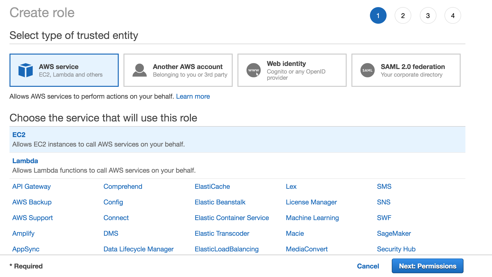
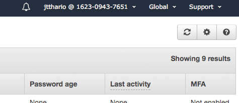

# Module 1: AWS IAM

This module guides the participant in configuring permissions for the AWS services used in this workshop. You will learn how to create and manage policies that permit access for users in your account to AWS Elemental MediaLive. You will attach these policies to roles and users in your account.

## Prerequisites

### Pre-configured AWS Account

If you are using a pre-configured AWS account, you will need to retrieve the ARN for the IAM Role that allows AWS Elemental MediaLive to access resources in your account.

1. Navigate to the AWS IAM Console
1. Select Roles
1. Find the Role previously defined to AWS Elemental MediaLive access
1. Select the Role to show it's summary
1. Select and copy the Role's ARN at the top of the page
1. Paste the Role ARN into text editor to save for later in the workshop
1. Skip forward to the next module

### No previous account configuration

In order to complete this workshop you'll need an AWS Account with access to create policies and roles within the AWS Identity and Access Management (IAM) service. 

The signed-in user must have the AdministratorAccess policy or a policy that allows the user to access all actions for the mediapackage service and at least read access to CloudWatch. The steps for creating a policy for AWS Elemental MediaPackage is covered near the end of this module.

The code and instructions in this workshop assume only one student is using a given AWS account at a time. If you try sharing an account with another student, you'll run into naming conflicts for certain resources. You can work around this by either using a suffix in your resource names or using distinct Regions, but the instructions do not provide details on the changes required to make this work.

### Region

AWS MediaLive and AWS MediaPackage are available in several regions. But for the purpose of this lab, we will use the **US West (Oregon)** region.

### Creating a Role to Use with AWS Elemental MediaLive
AWS Elemental MediaLive needs permission to make calls to AWS APIs on your behalf. For example,
credentials such as AWS Elemental MediaPackage or input passwords must be stored in the Parameter Store of EC2 Systems Manager.
The password key is then expected to be given to AWS Elemental MediaLive when creating the channel. AWS
Elemental MediaLive needs permission to access the value of the key from EC2 Systems Manager.

To create a role to use with AWS Elemental MediaLive:
1. Go to IAM -> Roles
2. Click on Create Role



3. Select AWS Service Role -> EC2 as role type -> EC2 as use case
4. Select AmazonSSMReadOnlyAccess and click on Next Step
5. Give the role a name such as “AllowMediaLiveAccessRole”
6. Click on Create Role
7. Find the role in the IAM Roles page
8. Click on the newly created role.
9. Find the Role ARN at the top of the page. Copy it and save it in your text editor or word processor. You will need this in later steps.
10. Click on tab called Trust relationships
11. Click on Edit trust relationship
12. Replace the existing policy with the following in the Policy Document edit window:
```
{
  "Version": "2012-10-17",
  "Statement": [
    {
      "Effect": "Allow",
      "Principal": {
        "Service": "ec2.amazonaws.com"
      },
      "Action": "sts:AssumeRole"
    },
    {
      "Effect": "Allow",
      "Principal": {
        "Service": "medialive.amazonaws.com"
      },
      "Action": "sts:AssumeRole"
    }
  ]
}
```
13. Click on Update Trust Policy

### Adding AWS Elemental MediaLive permissions to the current signed-in IAM user


Follow these steps to update the current user:
1. Go to IAM > Users
2. Find your currently signed-in user at the top-right of the console page.



3. Find the same user in the user list and click it to see details.
4. Click the **Add Permissions button**
1. Click **Attach existing policies directly**
1. Attach ‘AmazonS3ReadOnlyAccess’ and ‘CloudWatchReadOnlyAccess’ policies to
the user.
1. Click Next: Review
1. Click Add Permissions
4. Click on Add inline policy at the bottom right of the Permissions tab
1. Click on Custom Policy and click the Select button
5. For Policy name, use something like MedialiveAccessPolicy. In the policy document field, paste the
following.
6. Replace the value of the Resource attribute in the last statement of the policy with the Role ARN you created previously in this module
```
{
  "Version": "2012-10-17",
  "Statement": [
    {
      "Effect": "Allow",
      "Action": [
        "medialive:*"
      ],
      "Resource": "*"
    },
    {
      "Effect": "Allow",
      "Action": "iam:PassRole",
      "Resource": "INSERT ROLE ARN HERE" 
    }
  ]
}
```
6. Click on Validate Policy to check for typos, then click Apply Policy

### Adding AWS Elemental MediaPackage permissions to a IAM user (optional)

If the current user does not have the AdministratorAccess policy, use the following steps to attach a IAM policy to the user that allows access to AWS Elemental MediaPackage.

1. From the user's Summary page in IAM, click on Add inline policy at the bottom right of the Permissions tab
1. Click on Custom Policy and click the Select button
8. For Policy name, use something like MediaPackageAccessPolicy. In the policy document field, paste the following:
```
{
  "Version": "2012-10-17",
  "Statement": [
    {
      "Effect": "Allow",
      "Action": [
        "mediapackage:*"
      ],
      "Resource": "*"
    }
  ]
}
```
6. Click on Validate Policy to check for typos, then click Apply Policy

## Completion

At the end of the module you have created a IAM Role to allow access from MediaLive to resources in your account. You have also added MediaLive and, optionally, MediaPackage permissions to the signed-in user.

Move forward to the next module to configure [**AWS Elemental MediaPackage**](../2-MediaPackage/README.md).

Return to the [main](../README.md) page.

## Cloud Resource Clean Up

To manually remove resources created in this module, go to the AWS IAM console and remove the Role created here.

