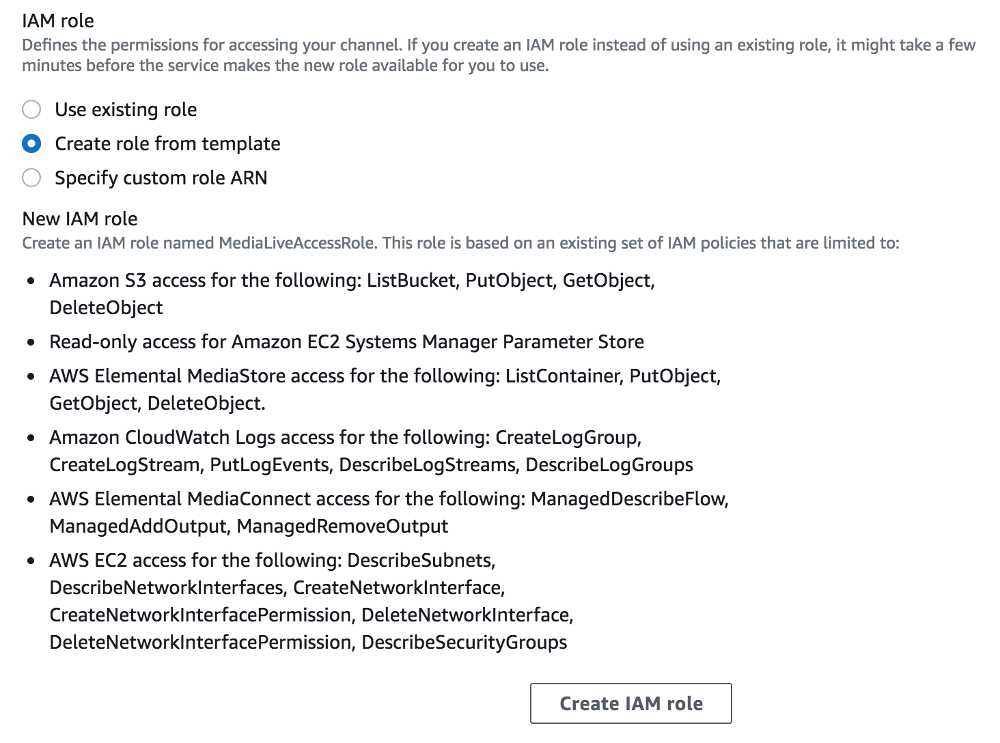

# Module 1: AWS IAM

This module guides the participant in configuring permissions for the AWS services used in this workshop. You will learn how to create and manage policies that permit access for users in your account to AWS Elemental MediaLive. You will attach these policies to roles and users in your account.

## Prerequisites

In order to complete this workshop, you'll need an AWS Account with access to create policies and roles within the AWS Identity and Access Management (IAM) service. 

The signed-in user must have the AdministratorAccess policy or a policy that allows the user to access all actions for AWS Elemental Live, AWS Elemental MediaPackage, Amazon CloudFront, and at least read access to CloudWatch. The steps for creating a policy for MediaLive and MediaPackage are covered near the end of this module.

The code and instructions in this workshop assume only one student is using a given AWS account at a time. If you try sharing an account with another student, you'll run into naming conflicts for certain resources. You can work around this by either using a suffix in your resource names or using distinct Regions, but the instructions do not provide details on the changes required to make this work.

### Region

MediaLive and MediaPackage are available in several regions. But for the purpose of this lab, we will use the **US West (Oregon)** region.

### Creating a Role to Use with AWS Elemental MediaLive
MediaLive needs permission to make calls to AWS APIs on your behalf. For example,
credentials such as MediaPackage input passwords must be stored in the Parameter Store of EC2 Systems Manager.
The password key is then expected to be given to MediaLive when creating the channel. MediaLive needs permission to access the value of the key from EC2 Systems Manager.
It is assumed that the logged in user to the AWS console has rights to access the MediaLive service and allowed to create IAM roles.  

To create a role to use with MediaLive:
1. Navigate to the [MediaLive console](https://us-west-2.console.aws.amazon.com/medialive/). 
1. Click on the **Create Channel** button.
1. Under **Channel and input details**, **General Info**, click on the **Create IAM role** button. This will create a role called `MediaLiveAccessRole`.

    

  1. If the **Create IAM role** button is not available, that means this role has been previously created.  
  
  1. If the **Use the existing role** is selected and an Update button is right next to the selected role, click on the **Update button**. 

### Adding MediaLive permissions to an IAM user (optional)

If the current user does not have the AdministratorAccess policy, use the following steps to attach an IAM policy to the user that allows access to MediaLive and other associated services needed while working on the MediaLive console. This will have to be done by someone with Admin access or someone with the appropriate IAM privileges. 

1. Go to IAM > Users.
1. Find the user that needs access in the user list and click it to see details.
1. Click the **Add Permissions button**.
1. Click **Attach existing policies directly**.
1. Attach `AmazonS3ReadOnlyAccess` and `CloudWatchReadOnlyAccess` policies to the user.
1. Click Next: Review.
1. Click Add Permissions.
1. Click on Add inline policy at the bottom right of the Permissions tab.
1. Click on the JSON tab.
1. Replace the policy document field with the following.

    ```
    {
      "Version": "2012-10-17",
      "Statement": [
        {
          "Effect": "Allow",
          "Action": [
            "medialive:*",
            "iam:ListRoles",
            "ssm:PutParameter"
          ],
          "Resource": "*"
        },
        {
          "Effect": "Allow",
          "Action": "iam:PassRole",
          "Resource": "INSERT MediaLiveAccessRole ARN HERE" 
        }
      ]
    }
    ```
  1. Replace the value of the Resource attribute in the last statement of the policy with the `MediaLiveAccessRole` ARN that was created earlier. 
      
      To retrieve the role ARN:
      1. On another browser tab, navigate to the [IAM console](https://console.aws.amazon.com/iam).
      1. Click on **Roles**.
      1. In the **Search** text box, type in `MediaLiveAccessRole`. Click on the role. 
      1. Under **Summary**, click on the copy icon to get the Role ARN. 

1. Click Review Policy button.
1. For Policy name, use something like MediaLiveAccessPolicy.
1. Click Create Policy button.

### Adding AWS Elemental MediaPackage and Amazon CloudFront permissions to an IAM user (optional)

If the current user does not have the AdministratorAccess policy, use the following steps to attach an IAM policy to the user that allows access to MediaPackage and CloudFront. This will have to be done by someone with Admin access or someone with the appropriate IAM privileges. 

1. Go to IAM > Users.
1. Find the user that needs access in the user list and click it to see details.
1. Click on Add inline policy at the bottom right of the Permissions tab.
1. Click on the JSON tab.
1. Replace the policy document field with the following.
    ```
    {
      "Version": "2012-10-17",
      "Statement": [
        {
          "Effect": "Allow",
          "Action": [
            "mediapackage:*", 
            "cloudfront:*",
            "tag:GetResources"
          ],
          "Resource": "*"
        }
      ]
    }
    ```
1. Click Review Policy button.
1. For Policy name, use something like MediaPackageAccessPolicy.
1. Click Create Policy button.

## Completion

At the end of the module you have created a IAM Role to allow access from MediaLive to resources in your account. You have also added MediaLive and, optionally, MediaPackage permissions to the signed-in user.

Move forward to the next module to configure [**AWS Elemental MediaPackage**](../2-MediaPackage/README.md).

Return to the [main](../README.md) page.

## Cloud Resource Clean Up

To manually remove resources created in this module, go to the AWS IAM console and remove the Role created here.

