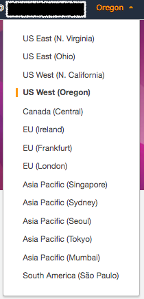
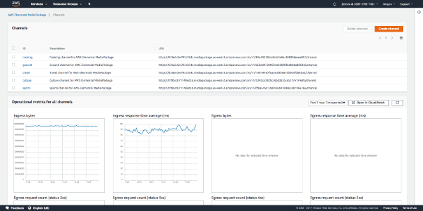
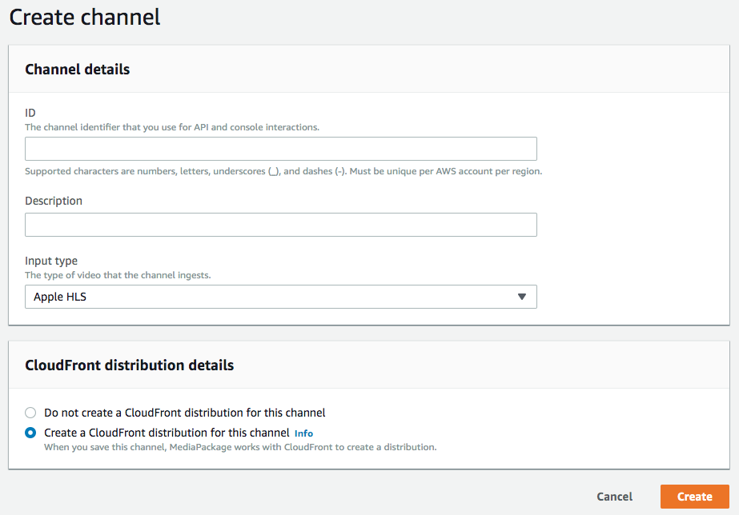
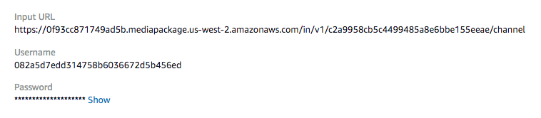
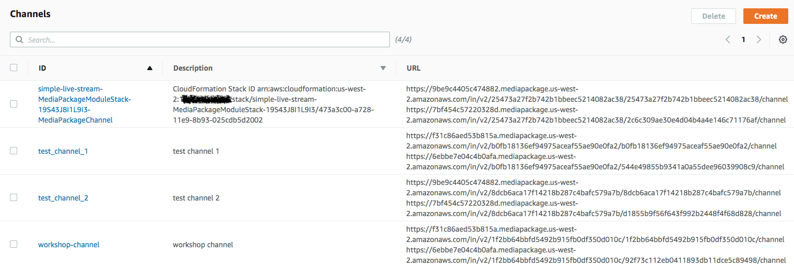
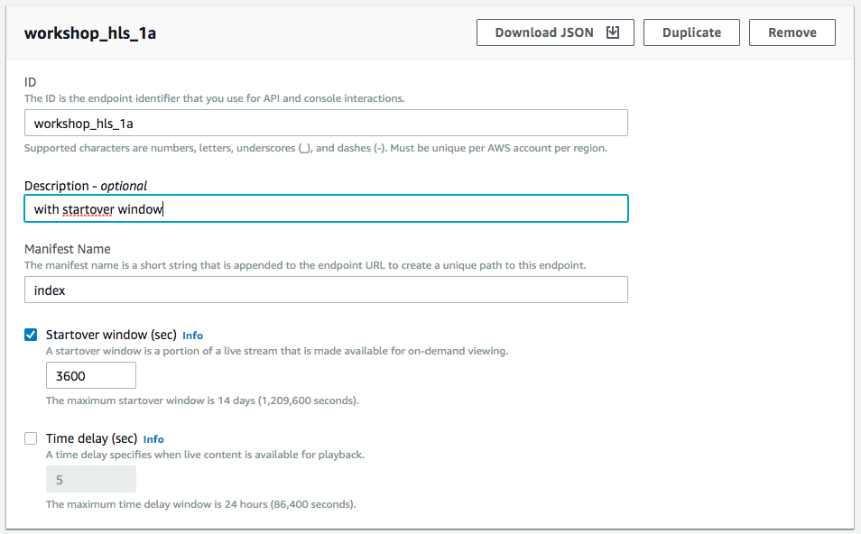
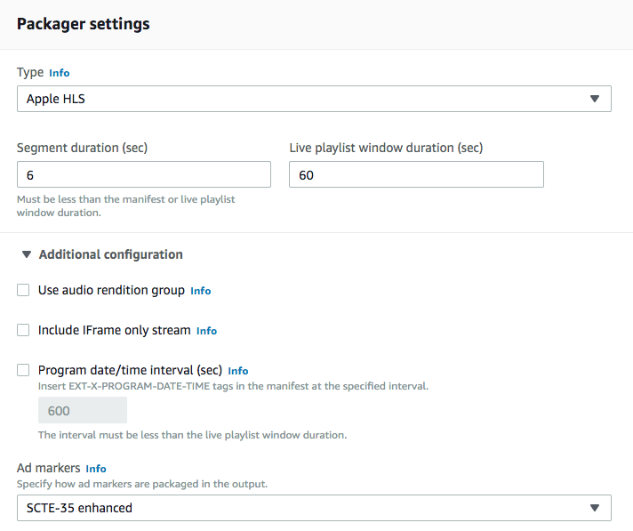
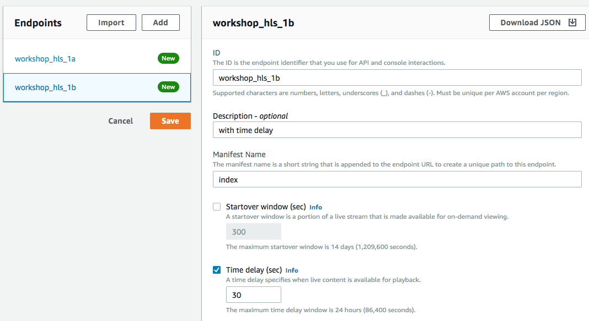

# Module 2: AWS Elemental MediaPackage

In this module, you'll configure AWS Elemental MediaPackage to process an incoming adaptive bitrate (ABR) video and produce an Apple HLS media stream that browsers and mobile devices can consume and play for viewers.

## AWS Elemental MediaPackage Overview

AWS Elemental MediaPackage is a video origination and just-in-time packaging service that allows anyone to securely and reliably deliver streaming content at scale.

In this module, you will use the AWS Console with AWS Elemental MediaPackage to create an ingest channel for receiving live video from AWS Elemental MediaLive and an origin endpoint for packaging and playback to specific device types.

## Prerequisites

### Previous Modules

This module relies on the configuration of IAM and MediaPackage. You must successfully complete these previous modules before attempting this one.

## Implementation Instructions

Each of the following sections provide an overview and detailed, step-by-step instructions. The overview should provide enough context for you to complete the implementation if you're already familiar with the AWS Management Console or you want to explore the services yourself without following a walkthrough.

If you're using the latest version of the Chrome, Firefox, or Safari web browsers the step-by-step instructions won't be visible until you expand the section.

### 1. Sign-in to AWS console

Navigate your browser to https://console.aws.amazon.com/console/home

You may be redirected to a sign-in page. If so, sign-in using the assigned credentials for your account and user.

Choose the **US West (Oregon)** region from the top-right of the AWS Console if the currently selected region is different.

### 2. Navigate to the AWS MediaPackage console

After signing-in, navigate your browser to https://us-west-2.console.aws.amazon.com/mediapackage/home?region=us-west-2#/channels

The channel listing page with configured channels and metric graphs are shown in the image below.

### 3. Create an ingest channel

AWS Elemental MediaLive creates a redundant (dual) channel configuration by default. In this section, we will create one AWS Elemental MediaPackage which by default will have two input URLs, each able to receive the adaptive bitrate streams from AWS Elemental MediaLive.

1. From the MediaPackage channel listing page, click the **Create Channel** button at the top-right.
2. Provide a channel ID and short description. 
3. Leave the input type as **Apple HLS**.

See the image below for the Channel Create page.

4. Click the Create Channel button.
5. Once the create operation completes, the next page will show the information for the newly created channel. Copy and save the input URLs, and their correponding username and password to a text editor or word processor. You will need to click the **Show** link next to the hidden password to display actual characters.

The next page shows the information for the newly created channel.

### 4. Create HLS origin endpoints for the channel

You will create two endpoings for the channel we just created. One origin endpoint with a restart window and a second endpoint with live output that is delayed by five seconds.

1. Return to the channel listing page for AWS Elemental MediaPackage console. Your page will contain the channel you created earlier, similar to the image shown below.

     

1. Click the channel you created.

1. Click the **Add/edit endpoints** button on the right side of the page.

1. Add an ID for the endpoint. For clarity, it should include the channel ID and the packaging format for the endpoint. For example, a meaningful name could be **workshop_hls_1a**.

1. Check the **Startover window** and set the maximum time to **3600**. This setting will allow a viewer to replay up to 3600 seconds (1 hour) past of streaming video using special parameters.

    

1. Under **Packager settings**, **Additional configuration**, enable **Ad Markers** by selecting **SCTE-35 enchanced** from the dropdown.
    
    

1. Leave all other settings at the default. 

1. Click the **Add** button at the top-left to add another endpoint.

1. Add an ID for the endpoint. For clarity, it should include the channel ID and the packaging format for the endpoint. For example, a meaningful name could be **workshop_hls_1b**.

1. Check the **Time delay** and set the delay time to **30**. This setting will delay the live playback by 30 seconds.

1. Under **Packager settings**, **Additional configuration**, enable **Ad Markers** by selecting **SCTE-35 enchanced** from the dropdown.

1. Leave all other settings at the default. Click on **Save** button. See the following image for sample inputs for the page.

    

1. Click the **Save** button.

## Completion

Congratulations!  You have successfully created an AWS Elemental MediaPackage channel for ingest and origin endpoints for playback. Move forward to the next module to configure [**AWS Elemental MediaLive**](../3-MediaLive/README.md).

Return to the [main](../README.md) page.

## Cloud Resource Clean Up

To manually remove resources created in this module, go to the AWS Elemental MediaPackage console and remove the endpoints from the channel first, and then remove the channel. AWS Elemental MediaPackage will not allow you to remove a channel with existing endpoints.
