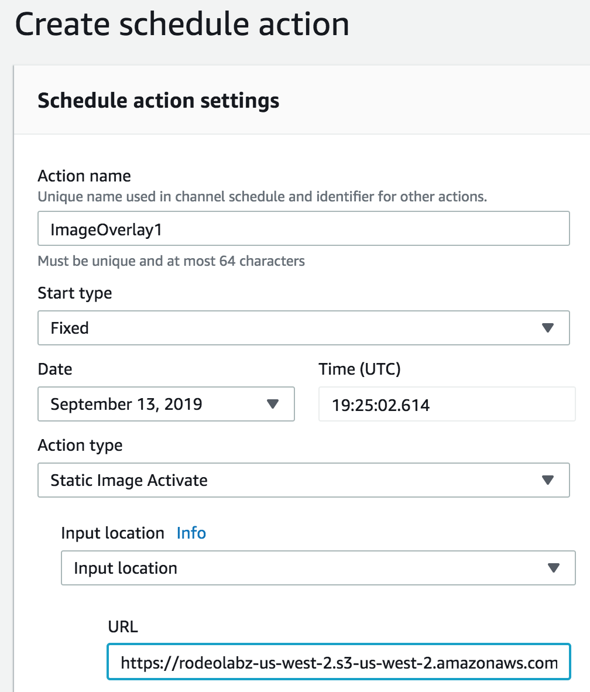
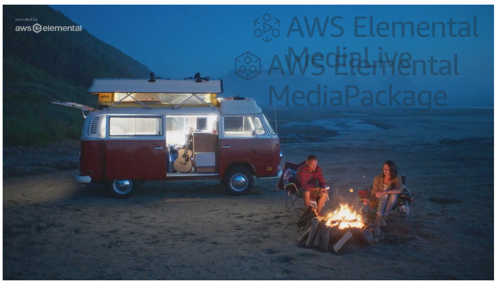

# Image Insertion with MediaLive

In this module you'll be inserting static images  onto your MediaLive channel's video. To do this, you create an insert action from the channel schedule, which then overlays your image onto your video at a specified time. 

## Prerequisites

* This module relies on the configuration of AWS IAM, AWS Elemental MediaPackage, and AWS Elemental MediaLive. You must successfully complete these previous modules before attempting this one. 

* You need to have your current MediaLive channel's video playing in order to see the images that are going to be inserted. If not, navigate to the [VideoJS demo player](https://videojs.github.io/videojs-contrib-hls/). Paste the MediaPackage channel endpoint's CloudFront URL in the video URL textbox and hit Load. If you're using the Safari browser, simply paste the URL in the address bar and hit Enter to start streaming. 

* Sample images are provided here, but if you'd like to use your own images to insert:
    * Place the prepared file in a location that is accessible to the MediaLive like Amazon S3.
    * Make sure image format is either .png, .bmp, or .tga image files.
    * Image can be any resolution (size in pixels) up to the same size as the underlying video.

## Implementation Instructions

### Insert a Static Image for a Specified Time and Duration
Here, you will insert a static image overlay at a specific time and run it for 60 seconds. The image overlay will appear in the upper-left corner of the video frame at 50% opacity. It will fade in from nothing to full 50% opacity over 10 seconds, then fade out to nothing starting 10 seconds before the end of the insertion.

1. Navigate to the MediaLive console. 
1. Click the link to your channel.
1. Under the **Schedule** tab of your channel, hit **Create** button.
1. Give the Schedule and Action Name like `ImageOverlay1`.
1. Under **Start Type**, select **Fixed** from the dropdown.
1. Set the **Date** to today's date and the **Time (UTC)** to a UTC time that's 2 minutes (minimum is 20 seconds) from now. This is to give us time to set up and schedule this action. To see current UTC time, visit https://time.is/UTC. 
1. Under **Action Type**, select **Static Image Activate**.
1. Under the Input Location **URL**, enter `https://rodeolabz-us-west-2.s3-us-west-2.amazonaws.com/livestreamingworkshop/MediaLiveIcon.png`. Or enter location to your own image.

    
1. Set the following settings:
    * Opacity -  `50`
    * Image X - `650`
    * Duration (in ms) - `60000`
    * Fade in (in ms) - `10000`
    * Fade out (in ms) - `10000`
    * Leave the rest of the settings empty (default values)
1. Click **Create**.
1. Watch the video stream currently playing in your browser (see Prerequisites). Confirm that your image appears at the upper right corner at 50% opacity at the time you specified. It should fade out 10 seconds before the end of the duration you specified.

### Insert More Than One Image at a Time
This time you will insert two static images so that they both appear in the video with some overlap. One image overlay appears in a location and, while that image overlay is still showing, another image overlay appears in another location. 

#### Insert First Image
1. Navigate to the MediaLive console. 
1. Click the link to your channel.
1. Under the **Schedule** tab of your channel, hit **Create** button.
1. Give the Schedule and Action Name like `ImageOverlay2`
1. Under **Start Type**, select **Fixed** from the dropdown.
1. Set the **Date** to today's date and the **Time (UTC)** to a UTC time that's 2 minutes (minimum is 20 seconds) from now. This is to give us time to set up and schedule this action. To see current UTC time, visit https://time.is/UTC.
1. Under **Action Type**, select **Static Image Activate**.
1. Under the Input Location **URL**, enter `https://rodeolabz-us-west-2.s3-us-west-2.amazonaws.com/livestreamingworkshop/MediaLiveIcon.png`. Or enter location to your own image.
1. Set the following settings:
    * Opacity -  `50`
    * Image X - `650`
    * Duration (in ms) - `120000`
    * Fade in (in ms) - `10000`
    * Fade out (in ms) - `10000`
    * Leave the rest of the settings empty (default values)
1. Click **Create**.

#### Insert Second Image
1. Under the **Schedule** tab of your MediaLive channel, hit **Create** button.
1. Give the Schedule and Action Name like `ImageOverlay3`
1. Under **Start Type**, select **Fixed** from the dropdown.
1. Set the **Date** to today's date and the **Time (UTC)** to **30 seconds later than the time you specified for the last scheduled image overlay**.
1. Under **Action Type**, select **Static Image Activate**.
1. Under the Input Location **URL**, enter `https://rodeolabz-us-west-2.s3-us-west-2.amazonaws.com/livestreamingworkshop/MediaPackageIcon.png`. Or enter location to your own image.
1. Set the following settings:
    * Layer - `1`  (this will put our second image on top of the first image which is on Layer 0 by default)
    * Image X - `650`
    * Image Y - `100`
    * Opacity -  `50`
    * Duration (in ms) - `60000`
    * Fade in (in ms) - `10000`
    * Fade out (in ms) - `10000`
    * Leave the rest of the settings empty (default values)
1. Click **Create**.
1. Watch the video stream currently playing in your browser (see Prerequisites). Confirm that:
    * First image appears at the top right corner at the specified time. 
    * After 30 seconds, second image appears just slightly below the first image. They will overlap.  
    * After 60 seconds, second image disappears.
    * After 30 more second, first image disappears. First image should have been on screen for 2 minutes total.

    

### Extra Credit!
* Insert an image at the bottom right or left corner of your video. What coordinates (Image X and Image Y values) do you need to provide? Consider the resolution of your video.
* Do not provide a duration when overlaying an image - this will leave your image overlayed onto the video indefinitely. 
* Schedule a **Static Image Deactivate** action to manually remove the image from your video.
