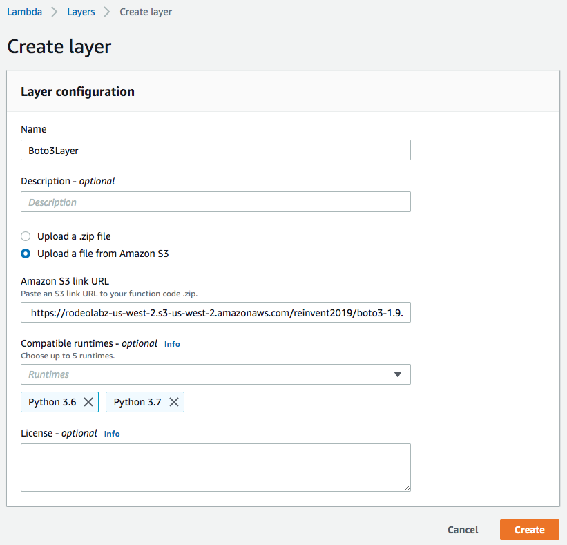
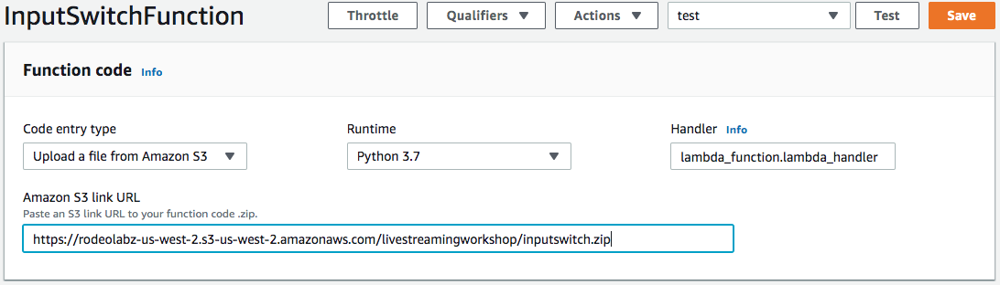
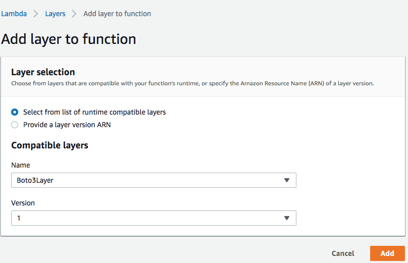
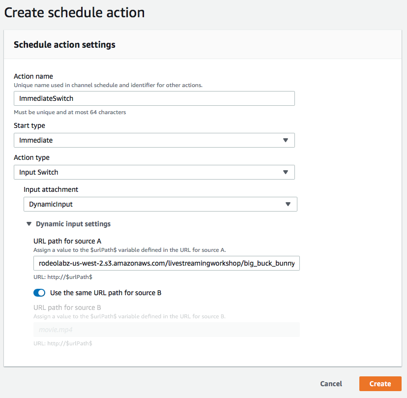
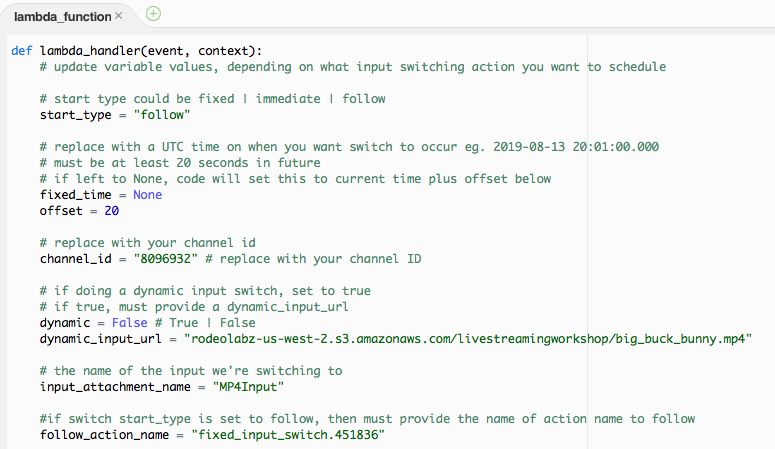
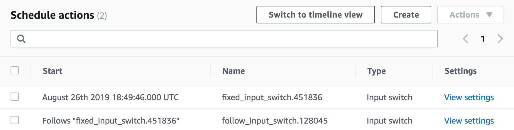

# Input Switching with MediaLive

In this module you'll be exercising the various types of MediaLive input switches.

## Prerequisites

### Previous Modules

This module relies on the configuration of AWS IAM, AWS Elemental MediaPackage, and AWS Elemental MediaLive. You must successfully complete these previous modules before attempting this one. 

This also assumes you have previously [created a MediaLive channel with multiple inputs](MultipleInputChannel.md). 

## Implementation Instructions

### Schedule Input Switches
We’re going to perform our first input switch by scheduling it through the console. Subsequent input switches will be done using a Lambda with provided sample code using the Boto 3 library.  We will exercise the 3 different start types for input switching: Fixed, Follow, and Immediate. Learn more about these switch types [here](https://docs.aws.amazon.com/medialive/latest/ug/ips-switch-types.html).

#### Create a Lambda Layer
We want to use a more recent version of the boto3 library than what is available on the Lambda runtime environment. We will create a Layer for boto3 that our Lambda function will use.
1. Navigate to the Lambda console.
1. On the left hand side of the console, select **Layers**. 
1. Click on **Create Layer**. 
1. Under **Layer configuration**, give the Layer a name like **Boto3Layer**.
1. Select **Upload a file from Amazon S3**.
1. Enter the following URL `https://rodeolabz-us-west-2.s3-us-west-2.amazonaws.com/reinvent2019/boto3-1.9.223.zip` into **Amazon S3 link URL** textbox.
1. Under **Compatible runtimes**, select **Python 3.6** and **Python 3.7**.
1. Click the **Create** button.
    

#### Create the Lambda Function
1. From the Lambda console, select **Functions** from the left hand side navigation.
1. Click on **Create Function** button.
1. Provide a function name like `InputSwitchFunction`.
1. Under **Runtime**, select `Python 3.7`.
1. Click **Create function**.
1. Scroll down to the **Function Code** section. 
1. Under **code entry type**, select **Upload a file from S3**.
1. Provide the following URL `https://rodeolabz-us-west-2.s3-us-west-2.amazonaws.com/reinvent2019/inputswitch.zip` in the **Amazon S3 link URL textbox**.

    
1. Scroll down to the **Basic settings** section and increase the **Timeout** to `1 min`.
1. Scroll back to the top of the console and select on the **Layers** button. This will show the layer configuration window below.
1. Click on **Add a Layer**. 
1. Under **Compatible Layers** select the **Boto3Layer** that you created previously.
1. Select **1** from the **Version** dropdown.

    
1. Click on **Add**. 
1. Click on **Save** button at the top of the console.

#### Update the Lambda Role
The default role automatically created by Lambda for the function does not give it access to MediaLive. Edit the role to add this access.

1. Select the **InputSwitchFunction** button to bring back the function settings. 
1. Scroll down to the **Execution role**. Click on the link **View InputSwitchFunction-role**. This will open a new tab to take you to the IAM console.
1. Click on **Attach Policies** button.
1. Click on **Create Policy** button. This will open a new tab. 
1. Select the JSON tab and Replace the textbox with the following:  
    ```
    {
        "Version": "2012-10-17",
        "Statement": [
            {
                "Sid": "VisualEditor0",
                "Effect": "Allow",
                "Action": "medialive:*",
                "Resource": "*"
            }
        ]
    }
    ```

5. Click on **Review Policy** button. 
6. Give the policy a name like `MediaLivePolicy`. 
7. Click on **Create Policy** button.
8. Back to the previous tab where you were attaching a policy, search for your newly created policy by putting in `MediaLivePolicy` in the filter textbox.
9. Select the policy and click on the **Attach Policy** button.


#### Immediate Input Switch
From the MediaLive console we will perform an immediate switch from the HLS VOD input to the Dynamic input.
1. Navigate to the MediaLive console. 
1. Click the link to your channel.
1. Under the **Schedule** tab of your channel, hit **Create** button.
1. Give the Schedule and Action Name like `ImmediateSwitch`
1. Under **Start Type**, select **Immediate** from the dropdown.
1. Under **Action Type**, select **Input Switch**.
1. Under **Input Attachment**, select the Dynamic Input you’ve previously created.
1. Under **Dynamic Input Settings**, provide the following URL `s3://rodeolabz-us-west-2/reinvent2019/big_buck_bunny.mp4`

    

1. Hit Create button.
1. After action has been created, a UTC time is shown on when the input switch is going to occur. 
1. Open a new tab on your browser, and navigate to the MediaPackage console. 
1. Locate and select the MediaPackage channel you created earlier.
1. In the **Endpoints** section, click on **Show CloudFront URL** and copy the URL.
1. Open a tab on your browser and navigate to the [VideoJS demo player](https://videojs.github.io/videojs-contrib-hls/). Paste the URL in the video URL textbox and hit Load. If you're using the Safari browser, simply paste the URL in the address bar and hit Enter to start streaming. 
1. Verify input switch happened at the time indicated by watching the video preview in MediaPackage. Video should have transitioned from the looping van life clip, to the Big Buck Bunny content.
1. Leave this video running on this browser tab to verify subsequent input switches.

#### Fixed Start Input Switch
We will use the Lambda function you created earlier to switch from the Dynamic input to the MP4 static file at a specified time. 

1. Navigate to the Lambda console.
1. Select the InputSwitchFunction.
1. In the lambda_handler function, update the following variables with the correct values:
    * **start_type**: set to "fixed"
    * **fixed_time**: set to a UTC time at least 20 seconds from now, or leave set to None and it will get set to current time + 20 seconds
    * **channel_id**:  set to your channel ID
    * **input_attachment_name**: set to the input we're switching to which is `MP4Input`
    
    
1. Save your changes by clicking on the **Save** button.
1. Trigger the lambda by clicking the Test button. If it's not enabled, then no test has been configured. To configure one:

    a. Click on **Configure Test Events**. New window pops up.

    b. Give an Event Name like `Test`.
    
    c. Click on **Create** button.
1. Test should run with no errors. 
1. On a different browser tab, navigate to the MediaLive console, click on your channel and select the **Schedule** tab. Verify that the a fixed input switch has been scheduled. 

    
1. Note the Name of the action that was scheduled as we will need this in the next input switch. It will be something like `fixed_input_switch.<random_number>`.
1. On the browser tab with the video player still running, verify switch happened at the fixed time provided. Content should go from Big Buck Bunny to the Gran Dillama clip.

#### Follow Start Input Switch
Using the same Lambda function, we will schedule a switch to our MediaConnect input after the MP4 static file reaches the end of file. In other words, MediaConnect input will follow the MP4 static file input we just switched to earlier. 
1. Navigate to the Lambda console.
1. Select the InputSwitchFunction.
1. In the lambda_handler function, update the following variables with the correct values:
    * **start_type**: set to "follow"
    * **channel_id**:  set to your channel ID
    * **input_attachment_name**: set to the input we're switching to which is `MediaConnectInput`
    * **follow_action_name**: set to the action name of the last switch we scheduled. This will be something like `fixed_input_switch.<random_number>`.
1. Save your changes by clicking on the Save button.
1. Test should run with no errors. 
1. On the browser tab that has the MediaLive console open, click on your channel and select the **Schedule** tab. Verify that the a follow input switch has been scheduled.

    
1. On the browser tab with the video player still running, verify switch happened when the Gran Dillama content ended. 

#### Immediate Switch to Initial Content
Using the same Lambda function, we will schedule a switch to our HLS VOD input immediately. 

1. Navigate to the Lambda console.
1. Select the InputSwitchFunction.
1. In the lambda_handler function, update the following variables with the correct values:
    * **start_type**: set to "immediate"
    * **channel_id**:  set to your channel ID
    * **input_attachment_name**: set to the input we're switching to which is `HLS Input`
1. Save your changes by clicking on the Save button.
1. Test should run with no errors. 
1. On the browser tab that has the MediaLive console open, click on your channel and select the **Schedule** tab. Verify that the an immediate switch has been scheduled.
1. On the browser tab with the video player still running, verify switch happened to the Van Life clip. 
