# Module 4: Browser Page

This module guides the participant in customizing a browser-based video player to view streaming video from the encoder and origin services created in the previous modules. You will learn how to test streaming video endpoints using web and standalone players. You will learn about the design of browser pages that support video playback, how different security models of browsers effect streaming playback, and how to access live and restart window streams of the origin service using URL parameters. 

## Prerequisites

### Previous Modules

This module relies on the configuration of IAM, MediaLive and MediaPackage. You must successfully complete the previous modules before attempting this one.

### Download the Workshop

If you want to customize the browser page in this module, you will need to download a copy of the workshop to your computer. The folder for this module (4-BrowserPage) includes a sample index.html page that you can customize with the HLS endpoints you created previously in AWS Elemental MediaPackage.

### Video Players for Testing

The AWS Elemental MediaPackage console includes an embedded player for checking the output of any origin endpoints. Each origin endpoint's console compartment will include a link to the endpoint for playback, a link to its CloudFront URL if CloudFront was enabled, a link to open the embedded player, and a link to display a QR code for playback on a mobile device.

You can use a standalone video player to view the HLS endpoint created in the AWS Elemental MediaPackage module, such as QuickTime, VLC or any workstation-based player that supports HLS. 

Finally, there are web-based players that can stream directly from AWS Elemental MediaPackage endpoints. In all cases, you provide the endpoint URL from AWS Elemental MediaPackage to the player.

1. https://www.hlsplayer.net/
2. http://videojs.github.io/videojs-contrib-hls/
3. https://developer.jwplayer.com/tools/stream-tester/


### Chrome, Firefox or Safari Browser

You will need Chrome, Firefox or Safari to complete this module. We will use the browser to load a web page from the local filesystem and play live and delayed streaming video. Firefox and Safari will work best when working with a mix of local and remote resources. Chrome requires some additional support to use in this mode. The steps to configure Chrome are included in this module.

### Text or Code Editor

You will need a text or code editor to customize the web page provided with this module. You will customize the web page with the AWS Elemental MediaPackage HLS endpoint created earlier in this workshop. We will be editing an HTML file that includes some JavaScript and CSS.

## Test the AWS Elemental MediaPackage HLS Endpoint

### Embedded Player
To test the MediaPackage endpoints directly, without going through the CloudFront distribution, we can do a video preview using the embedded player in the console. 

1. Navigate to the AWS Elemental MediaPackage console.
2. Select the channel you created previously.
3. Find the origin endpoint on the channel page.
4. Click the Play link under the Preview column to test with the embedded player. See the image below.

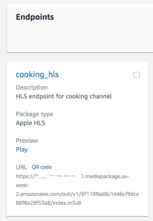

The embedded player will launch in a new frame. Press the play icon to start streaming.

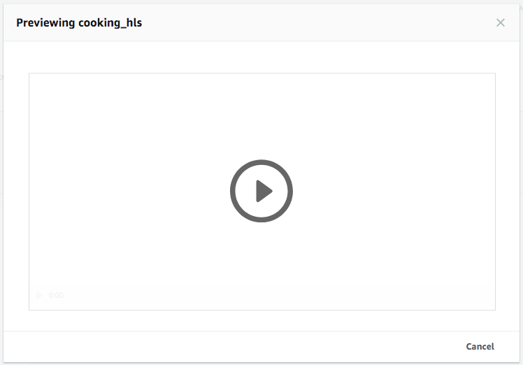

### Standalone and Web-based Players

1. Navigate to the AWS Elemental MediaPackage console.
2. Select a channel you created previously.
3. Find the origin endpoint on the channel page.
4. To test playback through the CloudFront distribution that got created by MediaPackage in the earlier module, click on the **Show CloudFront URL** link. 
5. Select and copy the URL for the endpoint. See the image below.

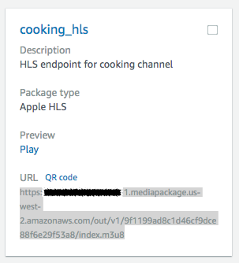
    
5. Paste the URL into the player you are using. If you are not sure how to begin playback, check the documentation of the player.

Make sure that the CloudFront distribution is in a deployed state, if you are using the CloudFront URL for playback. If it is deployed and video is not playing back, review the previous two modules.

## Try the Browser Page Using the Default Endpoint

The sample browser page provided with this workshop includes a default endpoint and will work as-is. The default endpoint is the same used as a source input to AWS Elemental MediaLive. This will always let you go back to a starting point that is known to be working.

If you are using Google Chrome, review the next section that explains how to use the browser with a mix of local and remote resources. If you are using Firefox or Safari, skip this section and continue with the **All Browsers** section.

### Chrome Security for Mixed Local/Remote Resources

Google Chrome's security model will not to operate with a mix of locally and remotely loaded resources. To work around this security constraint, we use a Chrome app called **Web Server for Chrome** that provides a basic web server that Chrome can use to load pages from the local file system.

1. Install this  [Web Server for Chrome](https://chrome.google.com/webstore/detail/web-server-for-chrome/ofhbbkphhbklhfoeikjpcbhemlocgigb).
1. Open the Apps page in Chrome by typing  `chrome://apps` in the URL of the browser. The App is named **Web Server** in the listing with an icon text of **200 OK!** See the image below.

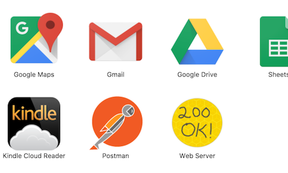

3. Click the icon to start the server. See the image below.

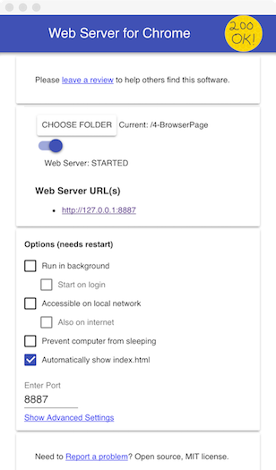

4. Set the folder for the server with the **CHOOSE FOLDER** button. Choose the folder named **4-BrowserPage** that contains this module so that index.html is at the root.
1. Click the web server URL provided for localhost. By default it will use http://localhost:8887. A new tab will open in Chrome and display the page.
1. Leave the **Web Server for Chrome** dialog open. When you close it, the web server will shutdown.
1. Continue with the **All Browsers** section. Remember to use the localhost link to display the page instead of loading it directly into the browser from the file system.

### All Browsers

Load the **live_delayed.html** page directly into your browser to display the player when using Firefox or Safari. Use the localhost link from **Web Server for Chrome** if you are using Google Chrome.

### Make a Copy

Make a copy of the downloaded workshop files in case you want to undo any changes and start over. You can also download a fresh copy of the workshop with the original page and code.

## Live and Time-Delayed Playback

### Page Usage

The example page contains two video player compartments. See the image below.

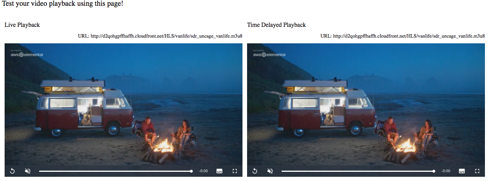

After you update the page, the player on the left will play at the live point. The player on the right will play the time-delayed version of the same content. 

### Page Design

The following image shows the high-level design of the cloud services and browser page components.

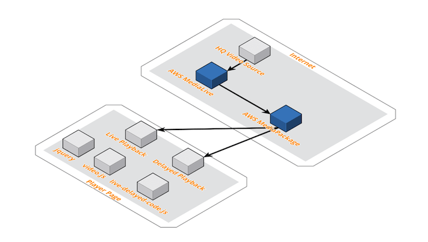

The file named **live-delayed-code.js** contains code to manage the page and configure the video player compartments. You will edit this file to change the HLS origin URLs.

### Update the Origin Endpoints

1. Find and open the file live-delayed-code.js in your editor.
2. Locate the line near the top of the file that starts with **var live_video_source =** followed by a quoted URL. See the image below.

    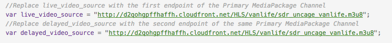
    
3. Replace the quoted URL with the live origin endpoint or corresponding CloudFront URL of the MediaPackage channel you created. This was the one created with startover window.
4. Locate the line that starts with with **var delayed_video_source =** followed by a quoted URL. 
5. Replace the quoted URL with the delayed origin endpoint or corresponding CloudFront URL that was configured for Time Delay of the MediaPackage channel you created.
6. Save the file and exit your editor.
7. Reload or refresh the player page in your browser. The players will now stream video from your instance of AWS Elemental MediaPackage.


## Live and On-Demand Playback

Load the **index.html** page directly into your browser to display the player when using Firefox or Safari. Use the localhost link from **Web Server for Chrome** if you are using Google Chrome.

### Page Usage

The example page contains two video player compartments. See the image below.

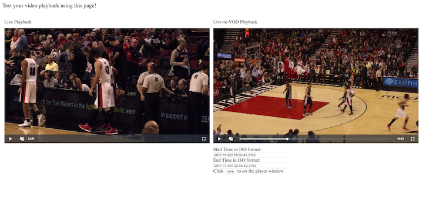

The player on the left plays at the live point. The player on the right is configured for video-on-demand (VOD) playback from the restart window of the origin service. You configured AWS Elemental MediaPackage for a one hour (3600 second) restart window in a previous module. By supplying time range parameters with the URL, we can create a temporary on-demand video up to the duration of the restart window size.

### Page Design

The following image shows the high-level design of the cloud services and browser page components.

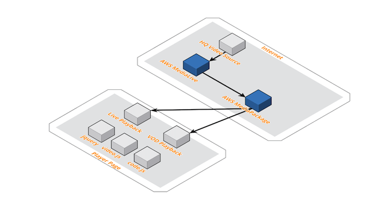

The same AWS Elemental MediaPackage endpoint serves video for the live and VOD player compartments. jQuery is used for page content manipulation. Video.js is used to create a common video playback capability across browsers with differing media support. Video.js documentation is available from http://docs.videojs.com/.

The file named **code.js** contains code to manage the page and configure the video player compartments. You will edit this file to change the HLS origin URL.

### Update the Origin Endpoints

1. Find and open the file code.js in your editor.
2. Locate the line near the top of the file that starts with **var video_source =** followed by a quoted URL. See the image below.

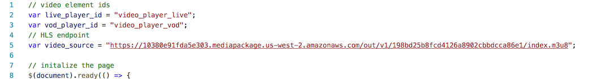

3. Replace the quoted URL with your origin endpoint or its CloudFront URL.

4. Save the file and exit your editor.
5. Reload or refresh the player page in your browser. The players will now stream video from your instance of AWS Elemental MediaPackage.

### Endpoint Use for Live and On-Demand

The same origin endpoints can be used for live and on-demand playback from the restart window of AWS Elemental MediaPackage. Recall in previous module for AWS Elemental MediaPackage the restart window for the origin endpoint was 3600 seconds (1 hour). By adding parameters to the origin endpoint or its CloudFront URL, you can specify exactly where to start and end playback.

The origin endpoint or its CloudFront URL used alone will automatically play from the live point. Adding **start** and **end** parameters to the URL will cause AWS Elemental MediaPackage to play from the restart window. Here are some examples:

```
/out/v1/9406d427fce145b282d04a68ddd34c44/index.mpd?start=2017-08-09T02:08:43+00:00&end=2017-08-09T02:09:13+00:00
/out/v1/8e1a636f9a6a489f9582ab2f2930a801/start/2017-08-09T02:10:14-00:00/end/2017-08-09T02:11:14+00:00/index.ism/Manifest
/out/v1/e4b11d69c1374ecc989ed4b7528e5d86/start/1502297760/end/1502297880/index.ism/Manifest
/out/v1/e97781fe36d74cdab3121315df2218c8/index.mpd?start=1502297460&end=1502297520
```

Remember you can only go back as far as the restart window time and the window is continuously moving. Review the right-side video compartment on the sample browser page to see how to use the restart window.


## Completion

At the end of the module you learned how to test streaming video endpoints using web and standalone players. You learned about the design of browser pages that support video playback, how different security models of browsers effect streaming playback, and how to access live and restart window streams of the origin service using URL parameters. 

Return to the [main](../README.md) page.
