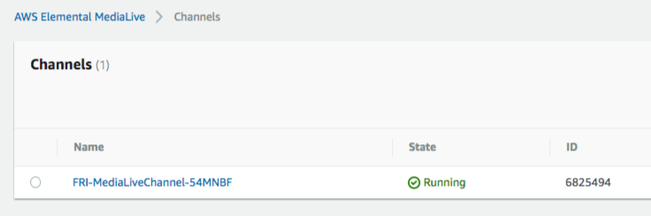

# AWS Live Streaming and Live-to-VOD Workshop

This workshop guides the student through creation of a streaming video workflow using an encoder in the cloud to produce adaptive bitrate (ABR) content and a packager to deliver the ABR streams to one or more viewers, including mobile devices and desktop browsers. This workshop includes a browser page configured as a simple client viewer, which the student can customize with their own streaming media and take advantage of live and delayed playback, and restart capabilities of the packager and player to replay portions of the video.

This workshop includes an optional module for configuring AWS CloudWatch Metrics and Alarms to track services usage from a graphical dashboard.

# Workshop Modules

1. [**AWS IAM**](1-IAM/README.md) - This module guides the participant in configuring permissions for the AWS services used in this workshop. You will learn how to create a policy that permits access to AWS Elemental MediaLive in your account and you will attach the policy to a role that you will use in your AWS Elemental MediaLive channel definitions.

2. [**AWS Elemental MediaPackage**](2-MediaPackage/README.md) - This module guides the participant in configuring a video origin service in the cloud using AWS Elemental MediaPackage. You will learn how to create channels for ingesting live video from AWS Elemental MediaLive and create endpoints for viewing video from browsers and mobile devices. In the following module, you will connect AWS Elemental MediaLive to AWS Elemental MediaPackage to create the end-to-end workflow.

3. [**AWS Elemental MediaLive**](3-MediaLive/README.md) - This module guides the participant in configuring a streaming source for live video. You will learn how to create input sources and channels in AWS Elemental MediaLive, and connect channels between AWS Elemental MediaPackage and AWS Elemental MediaLive. At the end of this module, the participant will have created a video service accessible by standalone video players, such as QuickTime, VLC or a hosted player in a web page.

4. [**Browser Page**](4-BrowserPage/README.md) - This module guides the participant in customizing a browser page with an embedded player to stream video from AWS Elemental Media Services. The participant will learn aspects of streaming video to a browser and gain a basic understanding of the open source tools for building web sites that can stream live video. 

5. [**AWS Elemental MediaTailor**](5-MediaTailor/README.md) - This module guides the participant in configuring MediaTailor to insert advertisements into your streaming video. The participant will also learn how to deliver the video content with ads through Amazon CloudFront. This module assumes that MediaLive and MediaPackage channels have been set up by walking through Modules 2 and 3, or having run the CloudFormation templates first.

6. [**Extra: AWS CloudWatch**](Extra-CloudWatch/README.md) - This module guides the participant in customizing a dashboard with metrics to monitor the flow of data through the services. The particpant will learn about CloudWatch metrics, dashboards and alarms in the context of monitoring streaming video status in near real time. 

# AWS CloudFormation Templates

CloudFormation templates are available if you would like to move faster or see the intended outcome of a single module or the entire lab. Resources created by AWS CloudFormation will have unique naming patterns so that the same template can be used multiple times in teh same account and region without conflicting resource names. Resource names are prefixed with the stack name, template name, a short random string, and followed by the resource name. See the following example for AWS Elemental MediaLive channels created with these templates. The stack names **CHAN05** and **CHAN07** are specified by the user and prefixed to the channel name. The CloudFormation template name is also included in the naming.

Keep this convention in mind when locating resources created with these templates.

Following are links to CloudFormation templates for each module of the workshop. **Copy the link address and use that with CloudFormation to create the module contents in your account.** You may need to enter information into the CloudFormation template about resources created in previous modules. If you are not familiar with AWS CloudFormation, review the online [User Guide](http://docs.aws.amazon.com/AWSCloudFormation/latest/UserGuide/Welcome.html). 

**These templates are supported in regions: ap-northeast-1 ap-northeast-2 ap-southeast-1 ap-southeast-2 eu-central-1 eu-west-1 eu-west-3 sa-east-1 us-east-1 us-west-2**

- [**Entire Workshop**](https://s3-us-west-2.amazonaws.com/rodeolabz-us-west-2/cloudformation/LiveStreamingWorkshopResources.json) - This template will perform all the configuration steps of modules 1, 2, 3 and the Extra CloudWatch module. Module 5(MediaTailor) is optional.

- [**AWS IAM**](https://s3-us-west-2.amazonaws.com/rodeolabz-us-west-2/cloudformation/IAMResources.json)

- [**AWS Elemental MediaPackage**](https://s3-us-west-2.amazonaws.com/rodeolabz-us-west-2/cloudformation/MediaPackageResources.json)

- [**AWS Elemental MediaLive**](https://s3-us-west-2.amazonaws.com/rodeolabz-us-west-2/cloudformation/MediaLiveResources.json)

- **Browser Page** (not applicable)

- [**AWS Elemental MediaTailor** ](https://s3-us-west-2.amazonaws.com/rodeolabz-us-west-2/cloudformation/MediaTailorResources.json)

- [**Extra: AWS CloudWatch**](https://s3-us-west-2.amazonaws.com/rodeolabz-us-west-2/cloudformation/CloudWatchResources.json)

# Start the Workshop

Download a copy of this workshop to your computer if you want to complete the final module called [**Browser Page**](4-BrowserPage/README.md). Otherwise, you can follow this workshop online to complete the modules.

Move forward to the first module for [**AWS IAM**](1-IAM/README.md).
